For the last few weeks, I have been redesigning and migrating this website [annjose.com](https://annjose.com) to a new blog engine. It started as a simple migration, but then (surprise, surprise!) ballooned into a big project with redesign, redeployment, content cleanup, comments migration, and my favorite part - a **real-world agentic coding** project. 

Like most projects, 80% of the work finished in a week (everybody say - _Thank you Claude & Codex_), and the remaining 20% work took 4 weeks. 

And now, finally, it is done. The new [annjose.com](https://annjose.com) is shipped! 🎉🚀

I learned a lot doing this migration, so I am writing this post to share the main highlights of the project - why I did it, what actually changed, how I used AI coding agents, what was harder than expected, and a few before/after pictures for fun.

If you want the full detailed log, I documented the journey at [Rebuilding this site, with AI agents](/redesign).

## The Why

My original website was built [11 years ago](/blog/first-post-from-hugo) using [Hugo blog engine](https://gohugo.io/) and the `Blackburn` theme. It was a good theme for the time, but soon became dated and was not maintained.

Over the years, I added a ton of customizations on that template, added pages and [custom shortcodes](https://gohugo.io/shortcodes/). It was going fine, but it was slowly getting messier inside. So I wanted to clean it all up, make it prettier and easy to maintain - by moving to a modern framework like [Astro](https://astro.build/) - simple, developer-friendly and built on my favorite tech stack of TypeScript, Tailwind.

I had tried this before. In 2023, I started a redesign and planned to do it in two steps: first move to a newer Hugo template, then move to Astro. I made a prototype, but couldn't complete it - life happens, you see.

That's when I started using AI coding agents for my other projects and saw the shift happening in realtime. I was able to do things much faster and more than ever before. That motivated me to revive the stalled migration project.

## My Goal
I had three goals in mind:
1. **Migrate** - Move the blog from Hugo to Astro, preserve existing content, and move hosting from GitHub Pages to Cloudflare Pages.
2. **Redesign** - Refresh the design with a modern template, better typography, a Raspberry color palette, view transitions, and mobile optimizations.
3. **Modernize** - Add features the old site did not have: dark mode, full-text search, a better commenting system, automatically generated OG images and a floating Table of Contents.

## What Actually Changed

The migration meant preserving eleven years of URLs, images, comments, tags, and old Hugo conventions while replacing the engine underneath. The visible redesign was the easy part. The harder work was invisible - to make sure old links, old posts, old comments, and old habits still worked.

Some of the concrete work:

- Migrated 58 blog posts, including both page bundles with colocated images and single-file Markdown posts.
- Converted Hugo TOML front matter to Astro YAML front matter.
- Merged Hugo `topics` into canonical lowercase `tags`, with readable display labels for acronyms like AI and LLM.
- Converted Hugo shortcodes for tables, figures, videos, code highlights, and image groups.
- Preserved old URL patterns with Cloudflare redirects: `/post/*` to `/blog/*`, `/topics/*` to `/tags/*`, and `/index.xml` to `/rss.xml`.
- Preserved old Disqus comments as static archived comments and added Giscus for new comments.
- Added Pagefind search, responsive image handling, generated Open Graph images, MathJax SVG rendering, and a reusable table of contents.
- Reworked the homepage, about page, tags page, archives page, post layout, and mobile navigation.

## The How

I used multiple AI coding agents throughout the project: Claude, Codex, Pi and Open Code. They helped with planning, implementation, debugging, content migration, visual polish, redirects, OG image generation, and so on.

The agents wrote most of the code, especially the mundane parts: transforming content, writing validation scripts, moving files, updating references, and making repeated small UI adjustments.

But I did the parts that mattered. I decided what was worth building, how to preserve the taste and intent, when an agent was solving the wrong problem, and keeping the work grounded in reality. I went through several rounds on the design, theme, and details before I was happy with the result.

**Yes, this slowed me down. I am glad it did.** The friction is a feature, not a bug. It is what makes the final product actually meet your standards and worth anyone's attention. This was the real lesson for me - AI agents made the project faster, but I had to stay vigilant and steer it.

> Move fast in dev, then go slow and steady to prod.

## The Timeline

I started the redesign log on March 11, 2026. The first few days moved quickly: I picked AstroPaper, wrote the initial spec, scaffolded the Astro project, and got the first Cloudflare Pages deploy working by March 13.

March 14 was the heavy migration day. The migration script moved all 58 posts from Hugo into Astro, converted front matter, copied images, handled Hugo shortcodes, and renamed the URL structure from `/posts/` to `/blog/`.

By March 20-21, the core blog features were in place: the floating table of contents, tag cloud, comments, the About page, and the redesign page itself. By March 30, the support infrastructure had mostly caught up too - sample post, local tests, CI cleanup and new CI.

Then there was a gap. I was participating in a couple of hackathons and preparing for AI training at the local library and an AI workshop. When I came back, I had to reload the shape of the project in my own head despite the specs, the plans and notes.

The final stretch happened mostly from late April into early May. That was the slow polish phase: layout consistency, theme exploration, OG image refinement, mobile optimizations, and the small visual bugs that only show up when you keep looking at the real site.

## What Was Harder Than Expected

The last mile was mostly polish, correctness, and integration details.

The first version worked quickly. The version I trusted took much longer. Some bugs only showed up in the production build. Some warnings stayed around because of cache. A few integrations worked on first load, then broke when navigating between pages.

Giscus was easier than expected to set up, but Astro View Transitions made it more interesting. A static script tag worked on first page load, then disappeared during client-side navigation. The fix was to recreate the Giscus script on every `astro:page-load`.

The visual polish took the longest. The problems were not huge by themselves, but they added up. The hard part was looking at the site again and again and noticing the small things: the UI elements that did not line up, a dark-mode contrast that felt off, a theme that looked too generic.

> Agents are great at making changes fast. They are not great at deciding when a page finally feels right. This is where the human part mattered most. 

## The Results
The new site is built with **Astro 5, Tailwind CSS**, and the **AstroPaper theme**, and it deploys to **Cloudflare Workers**.

A side-by-side feature list of the old and the new:

| Feature | Hugo (before) | Astro (after) |
| --- | --- | --- |
| Engine | Hugo | Astro 5 |
| Theme | Blackburn | AstroPaper, customized |
| Styling | Theme CSS | Tailwind CSS |
| Hosting | GitHub Pages | Cloudflare Pages |
| Color palette | Hugo theme defaults | Raspberry palette with dark mode |
| Dark mode | No | Yes |
| Search | No | Yes, Pagefind |
| Tags page | Basic | Tag cloud with counts and display labels |
| Comments | Disqus | Archived Disqus + Giscus |
| OG images | Single static image | Per-post generated images |
| Table of contents | No | Desktop sidebar + mobile dropdown |
| RSS | Hugo `/index.xml` | Astro `/rss.xml`, old URL redirected |

## Before And After

The old site was built with Hugo and Blackburn. It was functional, but it looked and felt dated. The new site keeps the same writing archive but gives it a cleaner structure, better navigation, and a modern visual system.

### Home page
The old site did not have a home page, it was a blog-centric theme. The new version has a beautiful curated home page - a front door to show a short intro, latest writing and how to connect with me.

| New Home (Light) | New Home (Dark) |
| --- | --- |
| 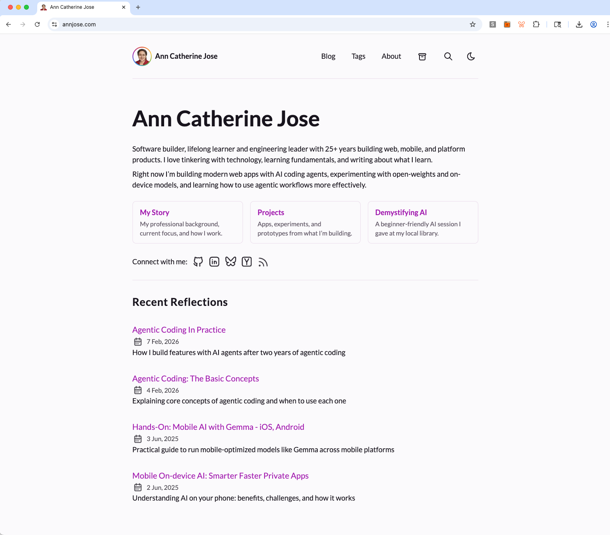 | 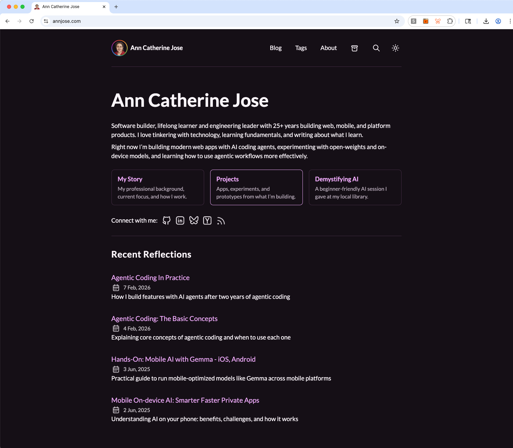 |

### Blog Page - Before / After
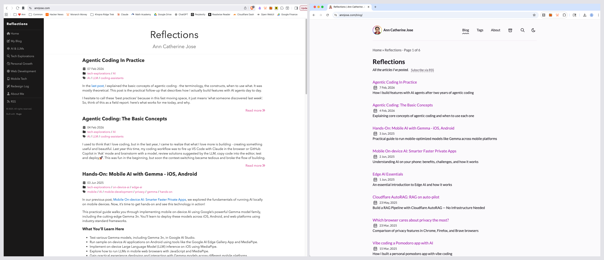

### About Page - Before / After

| Before (Hugo) | After (Astro) |
| --- | --- |
| 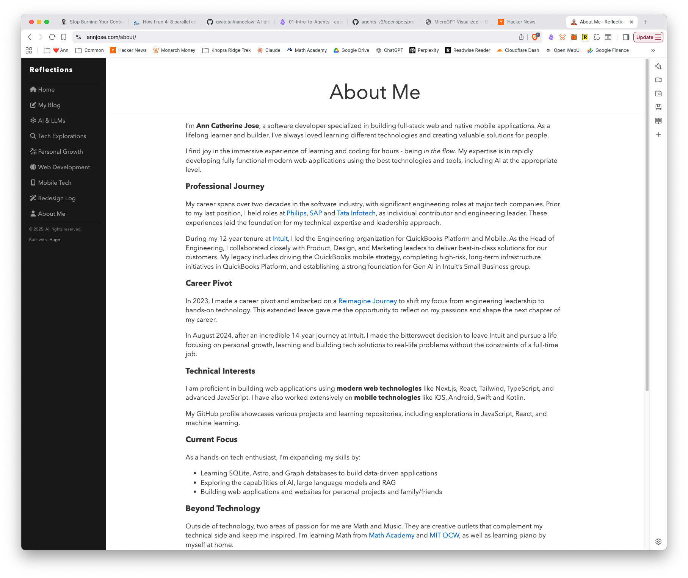 | 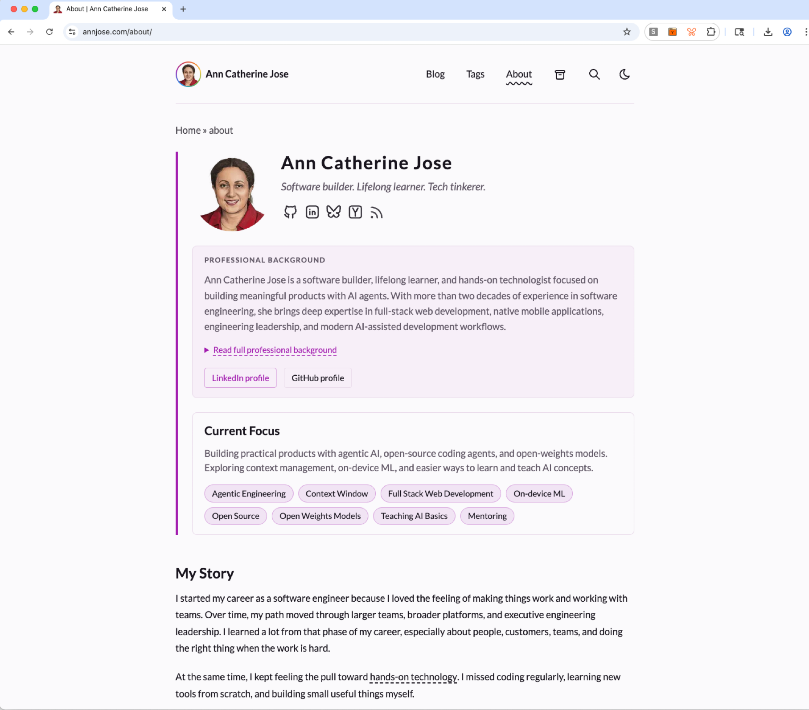 |

### What's new

| Tags Page (/tags) | Search Page (/search)|
| ---| --- |
| 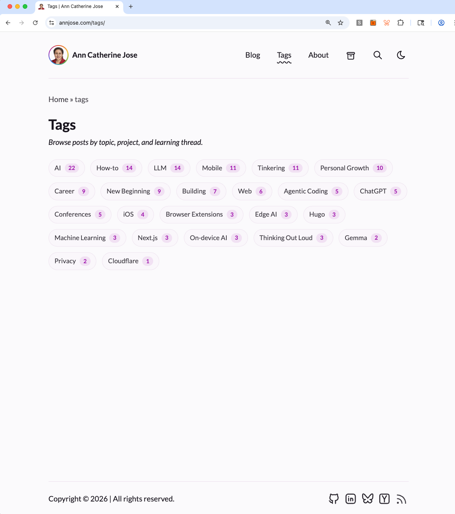 | 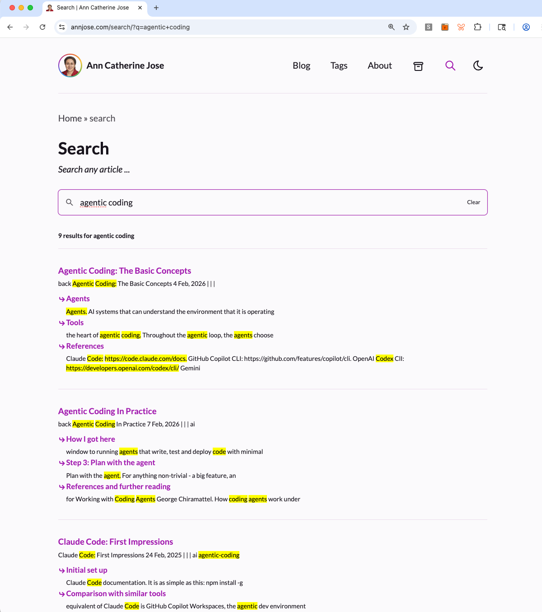 |

**Dark mode**
| About & Post | Archives & Tags |
| --- | --- |
| 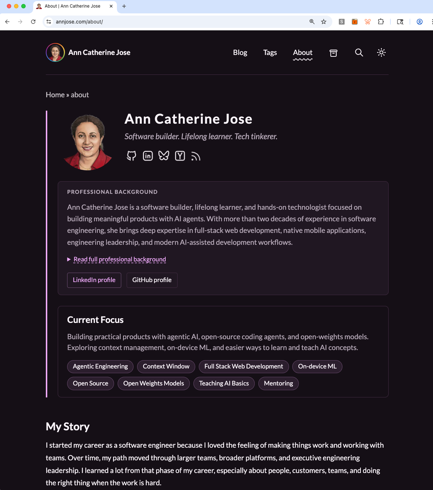 | 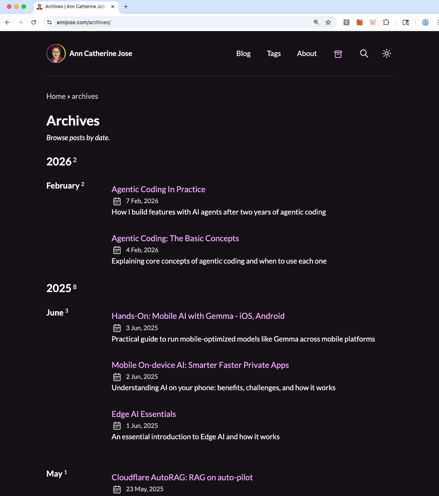 |
| 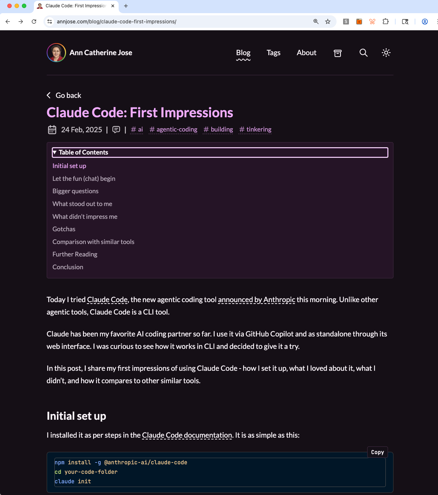 | 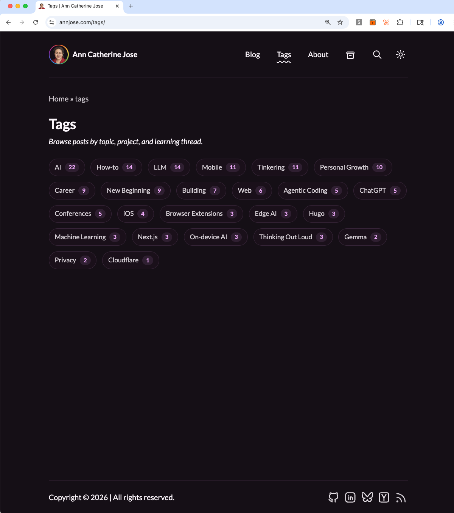 |

## Final Polish

The first working version was just the first, not the final. It had a warm/orange palette and I didn't like it because it felt like it belonged to the current Anthropic / AI product look. That was not what I wanted for a personal site.

So I tried other directions. First, I made simple HTML comparison pages using content from the About page, just to see how different colors felt against real text. Then I moved the experiment into the site itself as theme variables, with a local-only dropdown I could open using `?themePreview=1`. That let me compare Raspberry, Aubergine, Rosewood, and Brick on real pages instead of abstract swatches.

I chose Raspberry because it felt more personal and less cookie-cutter. It still works in light and dark mode, but it does not read like a generic AI startup theme.

The rest of the final polish was the same kind of work:

- Iterating on generated **OG image templates** and default social images.
- Curating the **tag taxonomy** across the archive so old variants do not split tag pages.
- **Polishing tag** chips and tag cloud display.
- Fixing **Lighthouse accessibility** issues on the blog post and tags pages.
- Tightening homepage, About page, and **layout details** after seeing them in context.

These are the kinds of details that are hard to delegate to an agent and the most time-consuming. But they are exactly what make a redesign feel done.

## Lessons Learned

The biggest lesson (I had heard it from many people, but this time I felt it for real): 

> AI agents are very fast, but the human still owns the hard parts - taste, judgment, context, tradeoffs, and noticing when something does not feel right.

A few things that worked for me:

- Ask "what am I missing?" when reviewing a plan.
- Ask "what could go wrong?" before implementation starts.
- Ask the agent to explain the expected behavior before fixing a visual bug.
- Check what the template already provides before building new features.
- Keep the spec and implementation plan separate and keep them in sync as you keep working

> The quality of the outcome depends on the questions I ask, the context I provide, and the decisions I make along the way.

## An Honest Take

I tried this project both with and without structured end-to-end agent workflows. Tools like [Superpowers](https://github.com/obra/superpowers) and [BMAD Method](https://docs.bmad-method.org/) can generate detailed specs, plans, and task lists, then execute against them. That structure is powerful, but it can also become rigid.

For this project, the hands-on approach worked better. I needed room to pause, compare options, reject visual directions, question the plan, and change my mind. The final site is better because there was space for human correction between agent steps.

## Final Thoughts

The full migration journal, with notes from each step, is at [annjose.com/redesign/](/redesign/).

This was one of the most useful personal projects I have done in a while. Part website migration, part engineering lab, part reflection on how software is built now.
